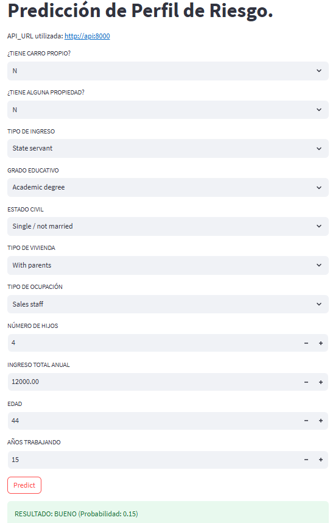

# GOOD/BAD APPLICANT CLASSIFIER. 

Este proyecto ofrece una solución end to end de Ciencia de Datos diseñada para clasificar a los solicitantes de crédito como "BUENOS" o "MALOS" con base en su historial financiero y de aplicación.

La solución incluye una API de FastAPI para realizar las predicciones del modelo de Machine Learning y una aplicación web interactiva de Streamlit para facilitar el uso de la solución por parte de los usuarios finales.

## 📋 CARACTERÍSTICAS PRINCIPALES.

*   **Modelo de Clasificación:** Por el momento, se utiliza un modelo `HistogramGradientBoosting` para predecir la probabilidad de que un solicitante sea un buen o mal cliente.
*   **API RESTful:** Una API construida con **FastAPI** para servir predicciones en tiempo real. 
*   **Interfaz de Usuario Web:** Una aplicación intuitiva desarrollada con **Streamlit** que permite a los usuarios introducir datos de un solicitante y recibir un veredicto de aplicación.
*   **Contenerización:** Todo el proyecto está contenerizado con **Docker**, permitiendo una configuración y despliegue simple y reproducible.
*   **Pipeline de MLOps Automatizado:** Un pipeline de CI/CD con **GitHub Actions** que automáticamente realiza un test unitario de la API, entrena el modelo, lo registra con **MLflow** y publica las imágenes de la API y la aplicación de Streamlit en Docker Hub.

## 🛠️ HERRAMIENTAS TECNOLÓGICAS.

*   **Backend:** Python (3.11.13), FastAPI
*   **Frontend:** Streamlit
*   **Machine Learning:** scikit-learn, xgboost, imbalanced-learn, category-encoders, pandas, MLflow
*   **Despliegue:** Docker, Docker Compose, Kubernetes
*   **CI/CD:** GitHub Actions

## 📂 ESTRUCTURA DEL PROYECTO.

```
good_bad_applicant_v2/
├── .github/workflows/mlops-pipeline.yaml  # Pipeline de CI/CD
├── data/                                  # Datos crudos y procesados
├── deployment/ 
│   ├── kubernetes/                        # Manifestos de Kubernetes para despliegue y generación de servicios
│   └── mlflow/                            # Docker Compose para levantar servicio de MLflow
├── models/                                # Modelo entrenado
├── notebooks/                             # Jupyter Notebooks para análisis y experimentación
├── src/
│   ├── api/                               # Código fuente de la API (FastAPI)
│   └── models/                            # Script para entrenamiento de modelos
├── streamlit_app/                         # Código fuente de la App (Streamlit)
├── tests/                                 # Pruebas unitarias y de integración
├── docker-compose.yaml                    # Orquestador de servicios locales
├── Dockerfile.api                         # Dockerfile para la API
├── Dockerfile.streamlit                   # Dockerfile para la App de Streamlit
└── README.md                              # Este archivo
```

## 🚀 AMBIENTE DE DESARROLLO Y DESPLIEGUE LOCAL.

Para ejecutar este proyecto localmente, se necesita tener **Docker** y **Docker Compose** instalados. Una vez hecho esto se realiza lo siguiente:

1.  **Clonar el repositorio:**
    ```bash
    git clone https://github.com/miguel-uicab/good_bad_applicant_v2.git
    cd good_bad_applicant_v2
    ```

2. **Crear el ambiente virtual de python usando UV:**
   Si se quiere correr los notebooks en local, hay que crear el ambiente,
   ```bash
   uv venv --python=python3.11
   source .venv/bin/activate
   ```
   e instalar las dependencias,
   
   ```bash
   uv pip install -r requirements.txt
   ```

3.  **Levantar los servicios con Docker Compose:**
    Este comando construirá las imágenes y levantará los contenedores para la API y la aplicación de Streamlit.
    ```bash
    docker-compose up --build
    ```
 
    Se pueden detener los contenedores usando.
    ```bash
    docker-compose down
    ```

4.  **Acceder a los servicios:**
    *   **API (FastAPI):** Abrir el navegador y usar la url `http://localhost:8000`.
    *   **Aplicación (Streamlit):** Abrir el navegador y usar la url `http://localhost:8501`.

5. **Pruebar la API:**
   Se puede usar el siguiente paylod para probar la API en la términal.

   ```bash
   curl -X POST "http://localhost:8000/predict" \
     -H "Content-Type: application/json" \
     -d '{
    "FLAG_OWN_CAR": "Y",
    "FLAG_OWN_REALTY": "Y",
    "CNT_CHILDREN": 0,
    "AMT_INCOME_TOTAL": 216000.0,
    "NAME_INCOME_TYPE": "Working",
    "NAME_EDUCATION_TYPE": "Higher education",
    "NAME_FAMILY_STATUS": "Married",
    "NAME_HOUSING_TYPE": "House / apartment",
    "DAYS_BIRTH": -18529,
    "DAYS_EMPLOYED": -1809,
    "FLAG_WORK_PHONE": 0,
    "FLAG_PHONE": 0,
    "FLAG_EMAIL": 0,
    "OCCUPATION_TYPE": "Secretaries"
    }'

    ```
   Resultado: `{"prediction":"BUENO","probability":0.3}`.

6. **Probar el frontend de Streamlit:**
   El frontend luce como en la siguiente imagen.



Se puede visitar una versión del frontend semi-deplegada a través de *Stream Community Cloud* [aquí](https://goodbadapplicantv2-nbquxxqrmbzvyhf5b2enup.streamlit.app/).


## 🚢 DESPLIEGE CON KUBERNETES.

Para desplegar la aplicación en un clúster de Kubernetes, se pueden los manifiestos YAML proporcionados en el directorio `deployment/kubernetes`.

**Prerrequisitos:**
*   Tener `kubectl` instalado (`sudo apt-get install kubectl`).
*   Tener `kind` instalado. Visitar la guía de instalación [aquí](https://kind.sigs.k8s.io/docs/user/quick-start).
*   Tener un clúster de Kubernetes levantado. Este [link](https://kubernetes-tutorial.schoolofdevops.com/adv_kubernetes-setup/#) ofrece una guía para levantar un clúster de 3 nodos con ayuda de `kind`.
*   Las imágenes Docker de la API (`migueluicab/good-bad-applicant-api:latest`) y de Streamlit (`migueluicab/good-bad-applicant-streamlit:latest`) deben estar publicadas en un registro accesible por el clúster (como Docker Hub). El pipeline de CI/CD se encarga de este paso.

**1. Desplegar los recursos:**

El siguiente comando creará los `Deployments` para la API y la aplicación de Streamlit, junto con los `Services` de tipo `NodePort` para exponerlos.

```bash
cd deployment/kubernetes
kubectl apply -f model-deployment.yaml -f model-service.yaml -f streamlit-deployment.yaml -f streamlit-service.yaml
```

**2. Acceder a la aplicación:**

Para acceder a los servicios, se necesita la dirección IP de uno de los nodos del clúster levantado.

*   **Obtener la IP del nodo:**
    ```bash
    kubectl get nodes -o wide
    ```
    Buscar la IP en la columna `INTERNAL-IP` o `EXTERNAL-IP`.

*   **Acceder a la aplicación Streamlit:**
    El frontend estará disponible en `http://<IP_DEL_NODO>:30000`.

*   **Accede a la API:**
    La API estará disponible en `http://<IP_DEL_NODO>:30100`.

    > **Nota para usuarios de `kind` y Docker Desktop:** Si está usando un clúster local como `kind` o el que viene con Docker Desktop, es muy probable que se pueda acceder directamente usando `localhost` en lugar de la IP del nodo.
    > *   **Streamlit:** `http://localhost:30000`
    > *   **API:** `http://localhost:30100`

**3. Limpiar los recursos:**

Para eliminar todos los recursos creados en el clúster, se puede usar el siguiente comando desde el mismo directorio `deployment/kubernetes`:

```bash
kubectl delete -f model-deployment.yaml -f model-service.yaml -f streamlit-deployment.yaml -f streamlit-service.yaml
```

## ⚙️ PIPELINE DE MLOPS.

Este proyecto utiliza un pipeline automatizado de MLOps definido en `.github/workflows/mlops-pipeline.yaml`. Este flujo de trabajo se activa con cada `push` o `pull request` a la rama `dev` y consta de los siguientes jobs:

1.  **`test`**:
    *   Instala las dependencias.
    *   Ejecuta las pruebas con `pytest` para garantizar la calidad y estabilidad del código.

2.  **`train-and-register-model`**:
    *   Si las pruebas pasan, este job entrena el modelo de clasificación.
    *   Inicia un servidor de **MLflow** temporal para registrar el experimento, las métricas y el modelo entrenado.
    *   Guarda el modelo (`good_bad_applicant_model.pkl`) como un artefacto para el siguiente paso.

3.  **`build-and-publish-api` y `build-and-publish-streamlit`**:
    *   Estos jobs se ejecutan en paralelo una vez que el modelo ha sido entrenado.
    *   **`build-and-publish-api`**: Descarga el artefacto del modelo, construye la imagen Docker de la API usando `Dockerfile.api` y la publica en Docker Hub.
    *   **`build-and-publish-streamlit`**: Construye la imagen Docker de la aplicación de Streamlit usando `Dockerfile.streamlit` y la publica en Docker Hub.

## 🤝 Contribuciones

Las contribuciones son bienvenidas. Si deseas mejorar este proyecto, por favor haz un fork del repositorio y crea un Pull Request.

